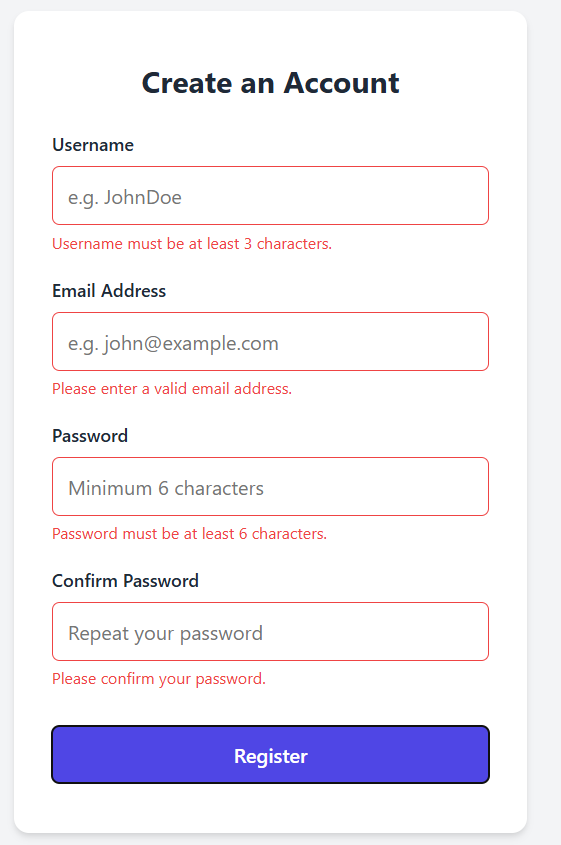

## Requirements

### Functional Requirements:
1. **User Input:** The form must allow users to input their Username, Email, Password, and Confirm Password.
2. **Validation:**
        All fields are required.
        The username must be at least 3 characters long.
        The email must be in a valid format.
        The password must be at least 6 characters long.
        The "Confirm Password" field must exactly match the "Password" field.
3. **Feedback:** The system must display specific error messages below the corresponding fields if validation fails.
4. **Submission:** Upon successful validation, the form prevents default submission (for demonstration purposes), hides the form fields, and displays a success message.

## Non-Functional Requirements:
1. **Semantics & Accessibility:** The HTML must use semantic tags (<form>, <main>, <label>). Every <input> must be explicitly linked to its <label> via id and for attributes.
2. **Responsiveness:** The form must be centered and adapt properly to both mobile and desktop screens.
3. **Styling Structure:** CSS must be decoupled from HTML (no inline styles), using class selectors.
4. **Performance:** JavaScript should be loaded at the end of the <body> to prevent rendering blockage.

## Registration Form

